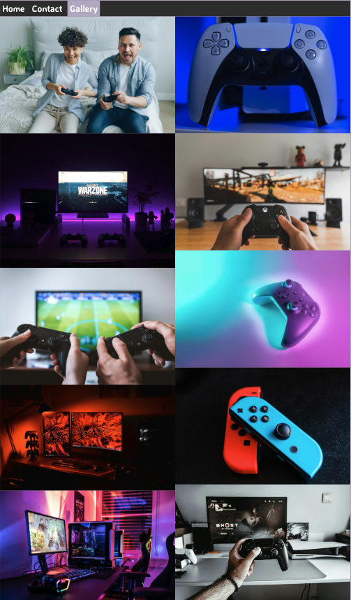

# Videogames Passion

Live project is available here https://ale-dp.github.io/videogames-passion/

Videogames Passion was born while playing online, and I thought would have been much better to have a reliable group of players with same passion in common.
Too many times, unless you plan an online match with you friends, matchmaking assign you someone from all around the world, but sometimes those people might cheat or drop you the game. 
And this is annoying and frustrating, so imagine if you can count on a group of reliable people that just want to play and have fun.

The purpose of Videogames Passion is to know people, share interests, favourite games and plan together games online, to limit the risk to be matched casually with someone with different intent.

# Features

- Title has a font that remind classic videogames with his "Pixelify Sans".

# Navigation Menu

- The navigation bar has a simple look and placement on all three pages of the website supporting easy navigation. It's an horizontal navbar, with Home , Contact and Gallery links and is responsive on multiple screen sizes. 

# Home Page

- Home page has a dinamic image of controllers below the navbar. Then the section "About Us " want to transmits a sort of reliabilty on who we are and what we offer, encouraging people to join us.
- The square image with rounded corners above the footer shows happiness playing together, even for a father with his son.

# Contact Page

- Contact page wants to attract with the 2 images with strong colors and a form with an attractive citation where you can share your details and your favourite platform.
- The button is styled with more contrast to get over the form, and the following "Join Us " section want to encourage people to be interactive and have their own group for whatever game they love to play together.

# Gallery Page

- The gallery is a list of attractive picture with strong colors showing different platforms and that the community is for all. A single column on smaller screen and 2 column on larger screen.

# Footer

- Footer section is styled with icons linked to the most relevant social media sites and is identical on each page making it easy to use. Links brings you to a new tab to allow easy navigation for the user.
This section it's important to encoureges users to get in touch and stay connected via social media in order to build strong relationship.

# Media

- Icons in the footer are taken from https://fontawesome.com/
- Pictures are from https://unsplash.com/it

# Technologies 

- Google Fonts was used to import the "Averia Sans Libre" and "Pixelify Sans" fonts into the style.css file which are used on all pages of the project. These were chosen as they work well together and have a a cool and appropriated style in relation to videogames.

- Font Awesome: was used to add icons for aesthetic purposes.

- Git: was used for version control by utilising the Gitpod terminal to commit to Git and Push to GitHub.

-GitHub: is used as the respository for the projects code after being pushed from Git.

# Languages Used

-HTML5

-CSS3

# Testing

- Validator Testing : 

[HTML Validator link](https://validator.w3.org/)

    - Gallery shows a warning but a section is more accurate than another div or heading not required here

[CSS Validator link](https://jigsaw.w3.org/css-validator/)

- Testing has been carried out on the following browsers :
    - Chrome Version 126.0.6478.127 (Official Build) (arm64)
    - Firefox Version 126.0.1 (64 bit)
    - Safari on macOS Sonoma 14.5 (Safari Version 17.5)

- Lighthouse Audits

# Deployment
- How this site was deployed

In the GitHub repository, navigate to the Settings tab, then choose Pages from the left hand menu

From the source section drop-down menu, select the Master Branch

Once the master branch has been selected, the page will be automatically refreshed with a detailed ribbon display to indicate the successful deployment

Any changes pushed to the master branch will take effect on the live project

# How to clone the repository

- Go to the https://github.com/Ale-DP/videogames-passion/deployments/github-pages repository on GitHub
- Click the "Code" button to the right of the screen, click HTTPs and copy the link there
- Open a GitBash terminal and navigate to the directory where you want to locate the clone
- On the command line, type "git clone" then paste in the copied url and press the Enter key to begin the clone process